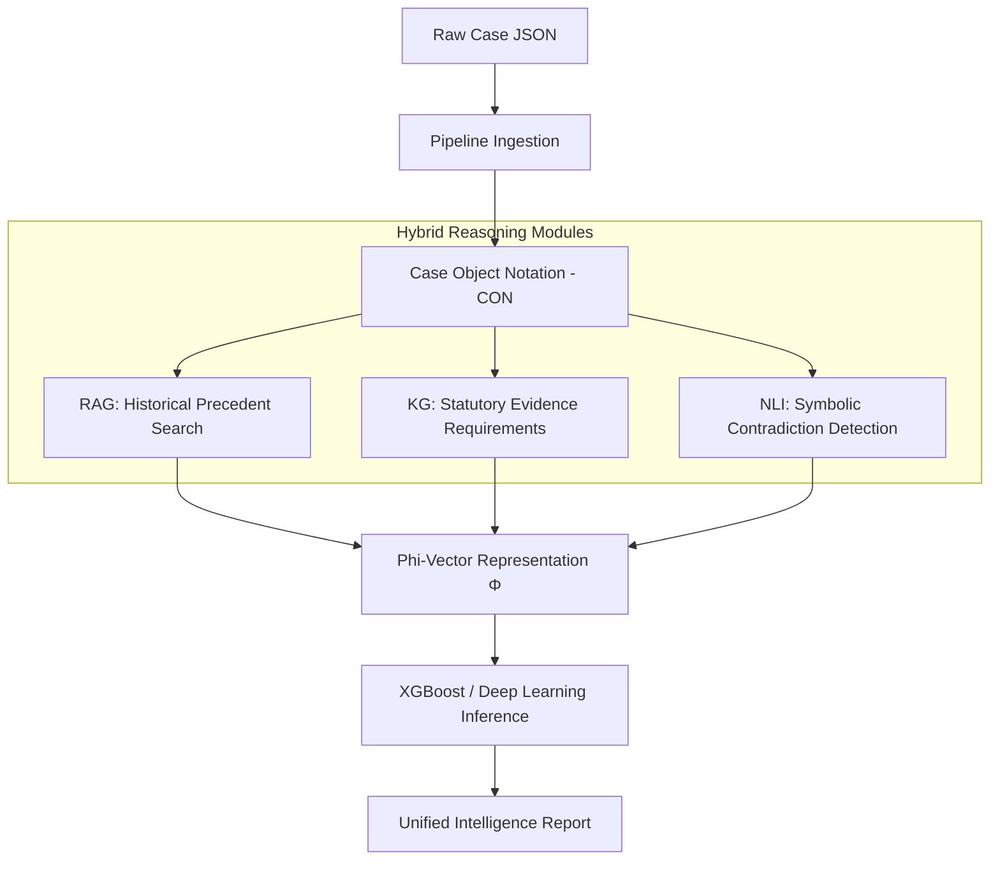

# ⚖️ Legal Intelligence System: Evidence-Aware Judicial Reasoning

An end-to-end research pipeline for **Representation Learning in Law.** This system transforms raw high-court judgments into a unified **Case Object Notation (CON)** and applies a hybrid reasoning architecture to forecast outcomes and identify evidentiary gaps.

---

## 🏛️ System Architecture



---

## 🧠 Core Methodology: The Phi Vector ($\Phi$)
The system represents legal cases as a high-dimensional feature vector $\Phi$ composed of four intelligence blocks:
- **$\Phi_{Context}$**: Categorical and complexity metrics (Case Type, Claims, Issues).
- **$\Phi_{Evidence}$**: 6-cluster multi-hot evidence presence markers.
- **$\Phi_{Gap}$**: Causal gaps between identified evidence and historical "Winning" patterns.
- **$\Phi_{Conflict}$**: Symbolic contradiction scores derived from text-evidence mismatches.

---

## 🚀 Quick Start

### 1. Installation
```bash
python3 -m venv venv
source venv/bin/activate
pip install -r requirements.txt
```

### 2. Run the Unified Pipeline (Single Case)
```bash
python main_pipeline.py
```

### 3. Run Scaling Batch (9,703 Cases)
```bash
python batch_process.py
```

### 4. Execute Ablation Study (ML Metrics)
```bash
python models/judgment/train_ablation.py
```

---

## 📂 Project Structure
- `con/`: Standardized **Case Object Notation** and **Feature Builder**.
- `retrieval/`: FAISS-based RAG using **InLegalBERT** embeddings.
- `models/`: Reasoning branches (Contradiction, Missing Evidence, Judgment).
- `pipelines/`: Data ingestion and cleaning layers.
- `notebooks/`: Research Dashboard and Presentation Demo.
- `outputs/`: Automatically generated plots, dashboards, and intelligence reports.

---

## 📈 Key Results
- **93.3% Accuracy** in pilot ablation studies.
- **Causal Feature Importance** identification (Evidence vs. Context).
- **Jurisdictional Bias Heatmaps** across all Indian High Courts.

---
*Created for the B.Tech Final Year Research Project.*
